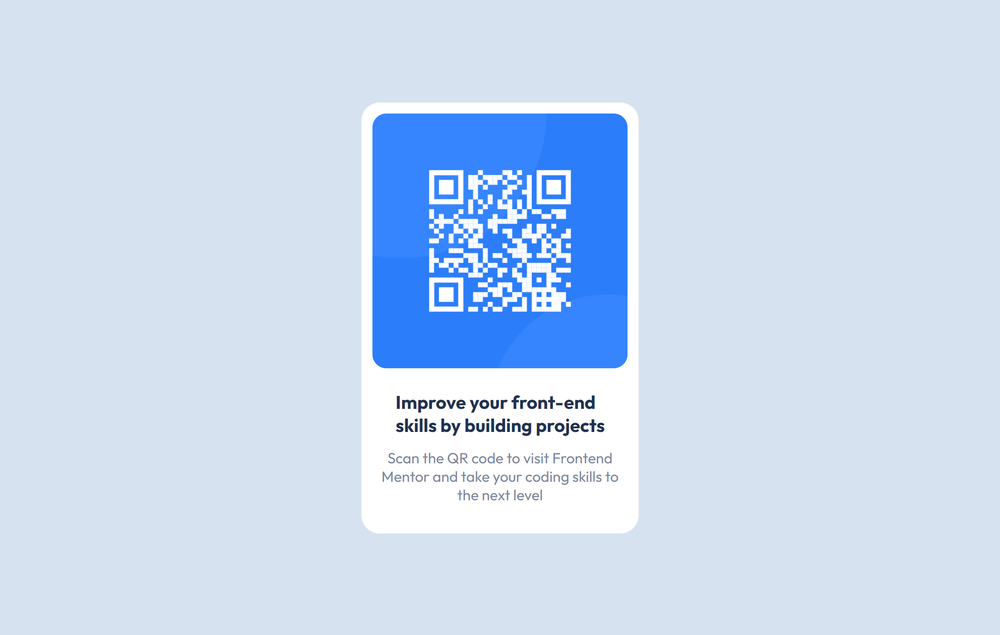

# Frontend Mentor - QR code component solution

This is a solution to the [QR code component challenge on Frontend Mentor](https://www.frontendmentor.io/challenges/qr-code-component-iux_sIO_H). Frontend Mentor challenges help you improve your coding skills by building realistic projects. 

*

### Links

- Solution URL: [Add solution URL here](https://github.com/RohyllerP/qr-code-frontedMaster)
- Live Site URL: [Add live site URL here](https://your-live-site-url.com)

- Website - [Rohyller](https://rohyllerp.github.io/briefcase/)
- Frontend Mentor - [@RohyllerP](https://www.frontendmentor.io/profile/RohyllerP)

